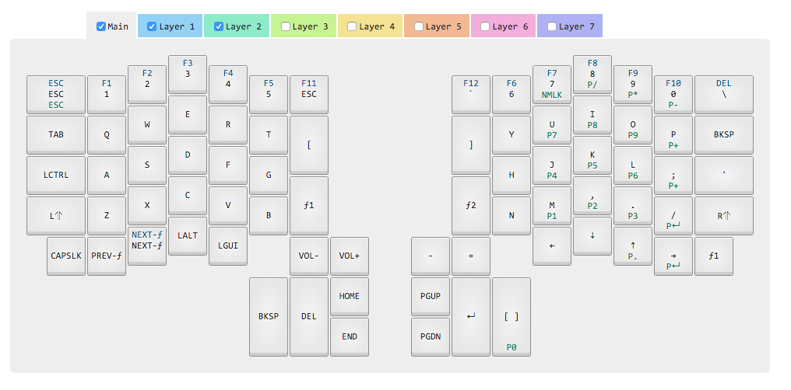

#ErgoDox Layout

More for my own reference than anything else, this is the layout provided by the [Input Club Configurator](https://input.club/configurator).

If it's the first time loading onto your dox, it's important to flash both sides of the dox. This will be simplified in the future, but nothing has been released yet. 

##Install
Simply enter the directory, flash the keyoard (which you should set a key to on a layer), and run `dfu-util -D right_kiibohd.dfu.bin`. After this is run, your dox's screen shouldn't be red anymore and your layout will be loaded. 

There is also an issue found with some latest versions of Mac where a downgrade to [dfu version 0.7](http://dfu-util.sourceforge.net/releases/).